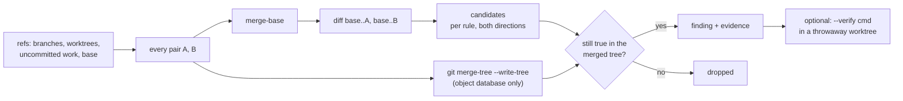

# How cleanbreak works

## Nothing in your checkout is touched

- Merges are simulated with `git merge-tree --write-tree`, which writes objects only.
- Uncommitted work in a worktree is captured with a temporary index file (`GIT_INDEX_FILE`) and `git commit-tree`: no stash, no ref, no change to the worktree. The result is an unreferenced commit that `git gc` will eventually collect.
- `--verify` runs your command in a temporary detached worktree and removes it afterwards.

## Rules

Each rule looks at what branch **A** removed or changed and what branch **B** newly _added_, then checks the simulated merge.

| Rule                   | A does                               | B adds                              | Re-checked in merged tree                                                         |
| ---------------------- | ------------------------------------ | ----------------------------------- | --------------------------------------------------------------------------------- |
| `removed-symbol`       | deletes or renames a definition      | a use of that name                  | no definition of the name remains anywhere                                        |
| `signature-change`     | changes a function's parameter count | a call with the old argument count  | no merged definition accepts that count                                           |
| `moved-path`           | renames or deletes a file            | an import or path that points to it | the old path is absent                                                            |
| `duplicate-definition` | adds `def foo`                       | adds another `foo` to the same file | the merged file defines it more than once, and more often than either side's copy |

### Visibility filter

A removed local variable named `next` does not break every file that happens to use the word. A candidate only survives when the using file can actually see the definition:

- JS/TS, Python, Rust: the using file must import the defining file (relative specifiers, extensionless, `index`, Python relative and absolute imports, Rust `mod`), or access it through a qualifier matching the module name (`cart.total(...)`).
- Go, Java/Kotlin, C#, Swift, PHP, Ruby, C/C++: same directory, a qualifier matching the file or directory name, or the file's name appearing in the using file.
- Member access such as `obj.name(...)` only counts for indented function definitions, i.e. class methods.
- Inside one file, local definitions in JS/Python/Go/Rust must be top level.

## What it deliberately does not do

- No type checking and no call graph. It reads definitions and calls one line at a time.
- No detection of behavioural conflicts that compile fine (two branches that each assume different semantics).
- Dynamic dispatch, reflection, re-exports through barrel files and macro-generated names are invisible to it.

That is why `--verify` exists: a heuristic raises the question, your own build or tests answer it.
